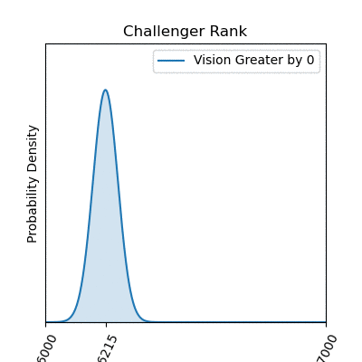
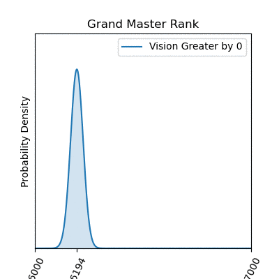

# Capstone 1 Proposal

For this project, I am primarily interested in expanding my toolset for exploring and analyzing data. I want to be able to generate high-quality graphs and information-conveying charts from a relatively unexplanatory data set so that an untrained or unfamiliar observer can come away from the presentation with adequate understanding of what might be important within that data.

## Dataset

[League of Legends Dataset](https://www.kaggle.com/gyejr95/league-of-legends-challenger-ranked-games2020)

## The Game

League of Legends is a MOBA-style (Multiplayer-Online-Battle-Arena) game where two teams of 5 champions each face off on Summoner's Rift to see who can destroy the other's Nexus (base) first. A team's base will continuously generate minions that walk down one of three lanes and attack any threats they come upon (other minions, towers, enemy champions). As a player, you control a champion who can support any of the three lanes of battle by killing enemy champions, minions, or towers, or a player can accrue team advantages by killing neutral 'jungle' minions to gain gold or buffs. 

In general, a good strategy is to get more enemy champion kills and more minion kills than your opponents, and generally that leads to a victory. However, there are other complex features to the game that contribute or detract from a player's chance of winning, and my goal here will be to use this dataset to examine some of these other factors.

### How good is total gold as a predictor of a team's victory?

In general, the team with the most gold wins. Most actions (enemy champion kills, minion kills, objective kills) give gold to the player, and there is passive gold gained over time. Every player knows this, but I decided to briefly test this assumption.

### What if I can't get kills? Our Linear Regression says we can just place wards instead and win with our vision-skills!

But wait, when comparing beta distributions with increasing margins of blue vision greater than red vision, these graphs tell a different story. It looks like blue can maximize their chance of winning by having better vision than red, but only by about 8 to 10 wards. After that, there are negative returns!

<!-- *    -->