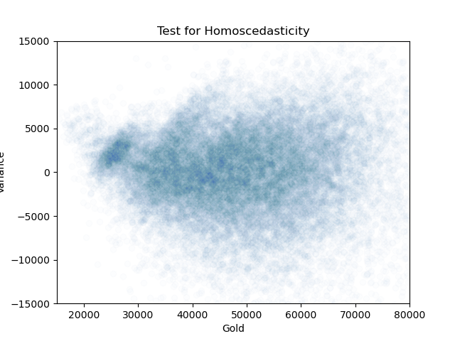
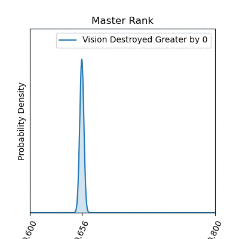

# Capstone 1 Project

For this project, I am primarily interested in expanding my toolset for exploring and analyzing data. I want to be able to generate high-quality graphs and information-conveying charts from a relatively unexplanatory data set so that an untrained or unfamiliar observer can come away from the presentation with adequate understanding of what might be important within that data.

## Dataset


[League of Legends Dataset](https://www.kaggle.com/gyejr95/league-of-legends-challenger-ranked-games2020)

## The Game

League of Legends is a MOBA-style (Multiplayer-Online-Battle-Arena) game where two teams of 5 champions each face off on Summoner's Rift to see who can destroy the other's Nexus (base) first. A team's base will continuously generate minions that walk down one of three lanes and attack any threats they come upon (other minions, towers, enemy champions). As a player, you control a champion who can support any of the three lanes of battle by killing enemy champions, minions, or towers, or a player can accrue team advantages by killing neutral 'jungle' minions to gain gold or buffs. 

In general, a good strategy is to get more enemy champion kills and more minion kills than your opponents, and generally that leads to a victory. However, there are other complex features to the game that contribute or detract from a player's chance of winning, and my goal here will be to use this dataset to examine some of these other factors. In particular, this data is representative of the 'meta' at the time it was drawn, which means that many of these conclusions will be defeasible by changes in the game as it updates and as new champions and elements of gameplay are released or changed.


### How good is total gold as a predictor of a team's victory?

In general, the team with the most gold wins. Most actions (enemy champion kills, minion kills, objective kills) give gold to the player, and there is passive gold gained over time. Every player knows this, but I decided to briefly test this assumption.

To test this, I settled on a beta distribution of blue gold versus red gold when blue wins the game. This distribution gave me a mean win-rate for blue when they have more gold of about 98%, and when I increased the margin of victory in blue gold over red gold (by increments of 1000), it approaches 100%, which means beating your opponent in total gold correlates **very** well with winning the game, and this makes sense because most actions in the game produce gold in various ways, so accomplishing more objectives, getting more kills, etc. will usually result in more gold. This allows players to purchase more items in-game, which increase their champion's power, allowing them to achieve victory.


## Next, I wanted to test whether first tower or first dragon was a more important objective for a team to concentrate on achieving.

<p align="center">
    
</p>

Sometimes, in order to accomplish an objective, a team has to 'give up' on another objective, allowing the other team to accomplish the objective instead. In this case, I split the data into two frames representing blue team wins when they killed the first dragon (but did not get the first tower in that game) and when they destroyed the first tower (but did not get the first dragon in that game). I chose to exclude games where they achieved both, as I thought this would not capture what I was trying to test for, namely when the team had to make a hard decision. First, I coded up some things to test the Challenger bracket of play.

```python
hyp_test_df = chall_df_clean[(chall_df_clean['blueFirstDragon'] > 0) & (chall_df_clean['blueFirstTower'] == 0)]
hyp_test_df2 = chall_df_clean[(chall_df_clean['blueFirstTower'] > 0) & (chall_df_clean['blueFirstDragon'] == 0)]
drag_total = len(hyp_test_df)
tow_total = len(hyp_test_df2)
drag_sample_freq = np.sum(hyp_test_df['blueWins'])/drag_total
tow_sample_freq = np.sum(hyp_test_df2['blueWins'])/tow_total
difference_in_sample_proportions = tow_sample_freq - drag_sample_freq
print(f"First dragon win frequency: {drag_sample_freq:2.2f}")
print(f"First tower win frequency: {tow_sample_freq:2.2f}")
print("Difference in sample proportions: {:2.2f}".format(difference_in_sample_proportions))
```
```python
Output:
First dragon win frequency: 0.36
First tower win frequency: 0.66
Difference in sample proportions: 0.30
```

This was already a surprising result for me! I intuitively believed that getting the first tower would be more valuable, but I conjectured that trading first tower for the first dragon would make a more even result, especially since killing a dragon gives that entire team extra stat-buffs on their champions, but this trade is *heavily* skewed in favor of a blue victory (in this case, by 30%!). I went ahead and coded up a hypothesis test to make sure that variance wasn't doing anything here to mess up the result, but it quite obviously confirmed what I already saw here. Gaining first tower is far more important to increasing a team's win percentage than killing the first dragon.

I also tested this code on the Grand Master and the Master brackets, and found that in Grand Master the margin was slighly larger in favor of taking first tower, and even more so in Master.


## Linear Regressions of a Few Things

I use a linear regression of least squares on my 'blueWardPlaced, 'blueKills','blueTotalHeal', and 'blueTotalObjectDamage' columns, and use blue's wins as the dependent variable. Of course, in order to use a linear regression, I needed to confirm that some assumptions were true.

1. Linearity - I believe these four columns can be modeled linearly because each kill (x) is worth a certain amount of gold (y), and even though ward placement, healing, and object damage don't correlate quite so nicely, they are still aspects of the game that can feasibly be interpreted to say something like "for each bit of 'x' I perform, it is worth 'y' amount of gold to my team."
2. Independence - Using the Durbin-Watson test on my data that is intended for linear regression, I got a score of 1.884. This shows some *positive* auto-correlation with the dependent variable, but very little since the value is close to 2, which means there isn't any auto-correlation.
3. Normality - To test the normality assumption, I used a QQ-plot of my residuals as seen below. This graph indicates that my residuals resemble a normal distribution,  but it does appear that there is some slight over-peaking in the middle of my distribution.

<p align="center">
    
</p>

4. Homoscedasticity - Again, I use a plot (this time a scatter) of my residuals to test for homoscedasticity. This plot indicates that my data is relatively homoscedatic, but not perfectly so.

<p align="center">
    
</p>

5. Multicollinearity - I checked the VIF score of each coefficient, and found the following:

* **'blueWardPlaced' = 7.04**
* **'blueKills' = 5.43**
* **'blueTotalHeal' = 8.03**
* **'blueObjectDamageDealt' = 7.10**

These scores indicate a moderate amount of multicollinearity, which could cause some concern. However, I attribute this to the fact that in many cases, getting a kill or damaging an object also induce healing in the champion who is doing the damage due to the effects of items and champion characteristics. So I removed healing from the regression, and discovered that this did not greatly effect the overall VIF scores of each of the other three variables, nor did it influence their coefficients by a large amount, so I decided to leave my regression as is and just accept that there could be some variation in my coefficients based on the potential multicollinearity of my variables.


After satisfying myself that the 5 assumptions for a linear regression were met to some satisfaction, I decided to go ahead with my columns for regression. My regression shows the following coefficients:

1. **'blueWardPlaced' = 164.88**
2. **'blueKills' = 748.24**
3. **'blueTotalHeal' = 0.19**
4. **'blueObjectDamageDealt' = 0.016**

Each of these coefficients had a p-value incredibly close to zero, making it likely that each of these independent variables are effectively influencing the dependent variable accurately based on our coefficients. In other words, we can be fairly confident that something like, "for each blue Ward placed in a game, this translates to approximately an increase in overall gold for the blue team by a factor of about 165 gold." This indicates that even if we can't get enemy champion kills (a more sure strategy), it appears that if we just out-vision our opponents, then we will still generate more gold and win the game. However, based on my assumptions, it appeared to me that a closer look at vision was appropriate, so I decided to do some testing using beta distributions.


## The Vision Game

To begin, I used a beta distribution that compared blue wins out of total games when blue had a larger 'vision score' than their opponent (roughly, they placed more ward trinkets on the map than their opponent). 
When comparing beta distributions with increasing margins of blue vision greater than red vision however, these graphs tell an interesting story compared to what we saw in the linear regression. It looks like blue can maximize their chance of winning by having better vision than red, but only by about 8 to 10 wards. After that, there are negative returns! I found this by taking multiple beta distributions of blue team's wins vs. red team's wins, but with blue's total ward placement being larger than red's by greater and greater margins. Even though having more wards than your opponent *in general* gives your team an edge, there comes a point where a player can over-invest in vision rather than other objectives that can increase a team's overall gold generation (which then indicates their higher likelihood of winning).


### Ok, so investing in lots of vision isn't enough. We need to do that some, but what else?

Continuing in our investigation into how vision impacts a game, I also considered similar beta distributions for each tier of gameplay, but this time focusing around destroying the opposing team's vision. In other words, these gifs display the progression of win rates as one team destroys significantly more vision than the other team. As we can see, destroying the opponent's vision seems to almost consistently improve one's win-rate, though with diminishing returns.



Either way, it appears that concentrating on vision is a nice way for an average player to improve their gameplay (and their team's overall victory chances) by a significant margin, so long as they are careful not to over-invest in placing vision.


# Conclusion

So what have I learned from this data?

1. As expected, getting more gold than your opponent generally results in winning the game. However, we cannot see a direct gold comparison until the end of the game, so it is hard to accurately and quickly tell (in-game) whether we are in front of our opponent's gold-wise.
2. In our team's early game, we should focus on taking the first tower, even if that means giving up on the first dragon. Getting both is nice! But if we have to sacrifice one, we ought to trade the dragon to get a tower.
3. Kills are the most reliable way to gain gold for your team, but kills aren't always readily available. Instead, we should focus our time on getting good vision (at least better than our opponent) especially with a focus on sweeping out our opponent's vision in order to create advantages that could lead to kills or control of objectives, which results in more gold generation for our team.