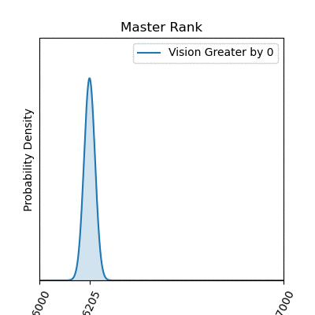

# Capstone 1 Proposal

For this project, I am primarily interested in expanding my toolset for exploring and analyzing data. I want to be able to generate high-quality graphs and information-conveying charts from a relatively unexplanatory data set so that an untrained or unfamiliar observer can come away from the presentation with adequate understanding of what might be important within that data.

## Dataset

[League of Legends Dataset](https://www.kaggle.com/gyejr95/league-of-legends-challenger-ranked-games2020)

## The Game

League of Legends is a MOBA-style (Multiplayer-Online-Battle-Arena) game where two teams of 5 champions each face off on Summoner's Rift to see who can destroy the other's Nexus (base) first. A team's base will continuously generate minions that walk down one of three lanes and attack any threats they come upon (other minions, towers, enemy champions). As a player, you control a champion who can support any of the three lanes of battle by killing enemy champions, minions, or towers, or a player can accrue team advantages by killing neutral 'jungle' minions to gain gold or buffs. 

In general, a good strategy is to get more enemy champion kills and more minion kills than your opponents, and generally that leads to a victory. However, there are other complex features to the game that contribute or detract from a player's chance of winning, and my goal here will be to use this dataset to examine some of these other factors.

### How good is total gold as a predictor of a team's victory?

In general, the team with the most gold wins. Most actions (enemy champion kills, minion kills, objective kills) give gold to the player, and there is passive gold gained over time. Every player knows this, but I decided to briefly test this assumption.

I use a linear regression of least squares on my 'blueWardPlaced, 'blueKills','blueTotalHeal', and 'blueTotalObjectDamage' columns, and use blue's wins as the dependent variable. Of course, in order to use a linear regression, I needed to confirm that some assumptions were true.

1. Linearity - I believe these four columns can be modeled linearly because each kill (x) is worth a certain amount of gold (y), and even though ward placement, healing, and object damage don't correlate quite so nicely, they are still aspects of the game that can feasibly be interpreted to say something like "for each bit of 'x' I perform, it is worth 'y' amount of gold to my team."
2. Independence - Using the Durbin-Watson test on my data that is intended for linear regression, I got a score of 1.884. This shows some *positive* auto-correlation with the dependent variable, but very little since the value is close to 2, which means there isn't any auto-correlation.
3. Normality - To test the normality assumption, I used a QQ-plot of my residuals as seen below. This graph indicates that my residuals resemble a normal distribution,  but it does appear that there is some slight over-peaking in the middle of my distribution.

    

4. Homoscedasticity - Again, I use a plot (this time a scatter) of my residuals to test for homoscedasticity. This plot indicates that my data is relatively homoscedatic, but not perfectly so.

5. Multicollinearity - I checked the VIF score of each coefficient, and found the following:

* 'blueWardPlaced' = 7.04
* 'blueKills' = 5.43
* 'blueTotalHeal' = 8.03
* 'blueObjectDamageDealt' = 7.10

These scores indicate a moderate amount of multicollinearity, which could cause some concern. However, I attribute this to the fact that in many cases, getting a kill or damaging an object also induce healing in the champion who is doing the damage due to the effects of items and champion characteristics. So I removed healing from the regression, and discovered that this did not greatly effect the overall VIF scores of each of the other three variables, nor did it influence their coefficients by a large amount, so I decided to leave my regression as is and just accept that there could be some variation in my coefficients based on the potential multicollinearity of my variables.

After satisfying myself that the 5 assumptions for a linear regression were met to some satisfaction, I decided to go ahead with my columns for regression. My regression shows the following coefficients:

1. 'blueWardPlaced' = 164.88
2. 'blueKills' = 748.24
3. 'blueTotalHeal' = 0.19
4. 'blueObjectDamageDealt' = 0.016

Each of these coefficients had a p-value incredibly close to zero, making it likely that each of these independent variables are effectively influencing the dependent variable accurately based on our coefficients. In other words, we can be fairly confident that something like, "for each blue Ward placed in a game, this translates to approximately an increase in overall gold for the blue team by a factor of about 165 gold." This indicates that even if we can't get enemy champion kills (a more sure strategy), it appears that if we just out-vision our opponents, then we will still generate more gold and win the game. However, based on my assumptions, it appeared to me that a closer look at vision was appropriate, so I decided to do some testing using beta distributions.

## The Vision Game

To begin, I used a beta distribution that compared blue wins out of total games when blue had a larger 'vision score' than their opponent (roughly, they placed more ward trinkets on the map than their opponent). 
But wait, when comparing beta distributions with increasing margins of blue vision greater than red vision, these graphs tell a different story. It looks like blue can maximize their chance of winning by having better vision than red, but only by about 8 to 10 wards. After that, there are negative returns! I found this by taking multiple beta distributions of blue team's wins vs. red team's wins, but with blue's total ward placement being larger than red's by greater and greater margins. Even though having more wards than your opponent *in general* gives your team an edge, there comes a point where a player can over-invest in vision rather than other objectives that can increase a team's overall gold generation (which then indicates their higher likelihood of winning).

### Ok, so investing in lots of vision isn't enough. We need to do that some, but what else?

Continuing in our investigation into how vision impacts a game, I also considered similar beta distributions for each tier of gameplay, but this time focusing around destroying the opposing team's vision. In other words, these gifs display the progression of win rates as one team destroys significantly more vision than the other team. As we can see, destroying the opponent's vision seems to almost consistently improve one's win-rate, though with diminishing returns 

<!-- *    -->